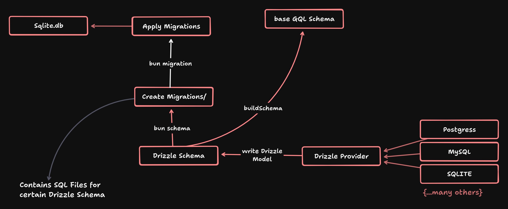
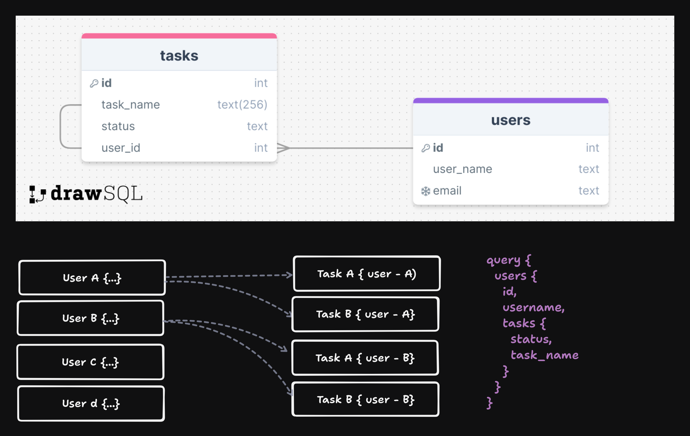

# Backend

## Getting Started

## Architecture



### Prerequisites
- bun

### Installation

```bash
bun install
```

1. generate schema
```
bun run db:schema
```
2. Apply Migrations
```
bun run db:migrate
```

### Running the application
```bash
bun dev
```

> [!TIP]
>  visit http://localhost:4000  for apollo server
> for db options check drizzle studio (`bun db:studio`)

> [!IMPORTANT]
> for some reason if migrations does not apply then run
> ```
>  rm ./sqlite.db
> ```


## Advantages

1. Drizzle automatically creates graphql mutations and queries just define the drizzle schemas
2. Manually add graphql schemas
3. with graphql data fetch like we want




### own schema
Drizzle generates a schema based on the models in your application. you can further customize the schema by adding additional entities and fields to the schema.

> [!CAUTION]
>  dont forget to add all other entities and fields to the schema


